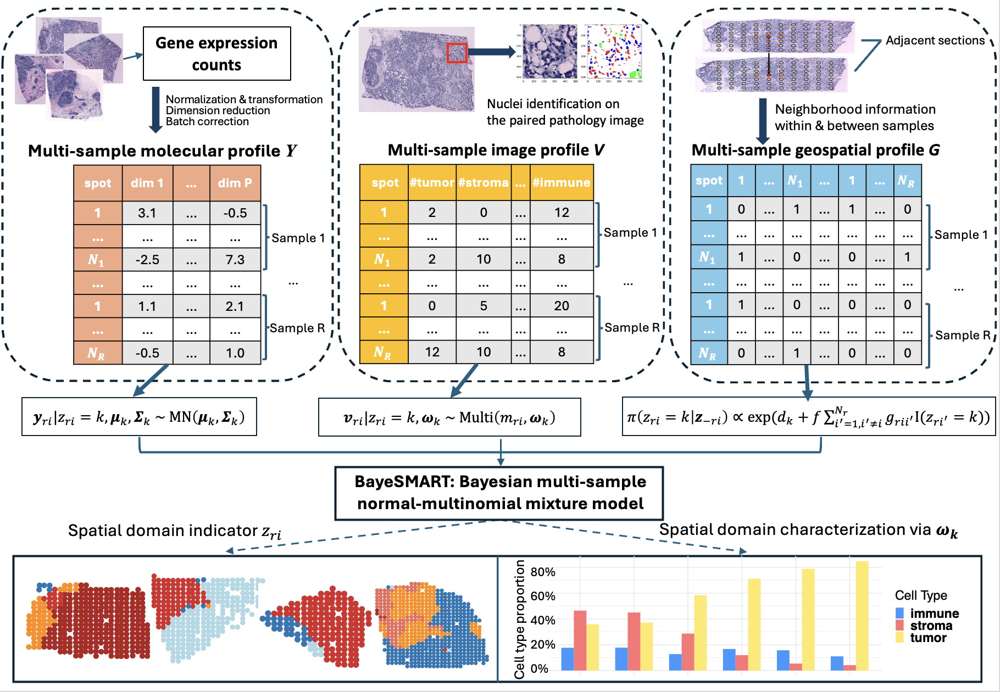

# BayeSMART: Bayesian clustering of multi-sample spatially resolved transcriptomics data





## Setup
**BayeSMART** was developed and tested under R 4.2.2. The following packages are required:
- Rcpp_1.0.11   
- mvtnorm_1.2-4 
- scater_1.26.1
- scran_1.26.2 
- MASS_7.3-60  
- harmony_0.1.1
- SPARK_1.1.1
- mclust_6.0.1  
- dplyr_1.1.4  


## Run the model
Import the model to R:
```r
source("~/code/BayeSMART.R")
```

import the data and preprocess to get the molecular, image, and spatial profiles
```r
load("~/data/HER2_p.RData")

xys <- lapply(xys_her2, function(info.i){
  as.matrix(info.i[, c("x", "y")])
})

# molecular profile
Y <- batch_remove(cnts_her2, xys=xys,  gene_select = "hvgs", n_gene = 2000, pcn = 3)

# image profile
V <- matrix(ncol = 3, nrow = 0)
for (s in 1:4){
  # filename = paste0(path, my_dict[[s]], ".RData")
  # load(filename)
  
  cell_info <- cell_info_her2[[s]]
  
  cell_xy <- cell_info[, 1:2]
  cell_name <- cell_info$name
  
  V1 <- get.cell.abundance(cell_xy, cell_name, xys[[s]], lattice = 'square')
  V1 <- new.cell.abundance(V1) # group cell types to only three kinds: tumor, stroma, and immune
  
  V <- rbind(V, V1)
}

# spatial profile
spatial_info <- spatial_concat(xys, n_neighbor = 8)
G <- spatial_info$G
G_origin <- spatial_info$G_origin
```

Then run the model
```r
# number of spatial domains
K <- 6

# weight of image profile
w <- 1/10

# run the miIMPACT model for spatial domain identification on multi-sample
result <- run.BayeSMART(V, Y, G, n_cluster = K, w = w)

# get the posterior inference on spatial domains
spatial_domain <- get.spatial.domain(result)
z_all <- domain_split(spatial_domain, G_origin)
```


## Calculate the ARI for each sample
```r
library(mclust)
scores_ARI <- c()

for (s in 1:4){
  spatial_domain_refined <- z_all[[s]]
  real_region <- xys_her2[[s]]$annotation
  
  ari_score <- adjustedRandIndex(spatial_domain_refined, real_region)
  scores_ARI <- c(scores_ARI, ari_score)
}

print(scores_ARI)
```

The result is
```r
> scores_ARI
[1] 0.6744486 0.3044600 0.7814962 0.3578727
```

## Tutorial for BayeSMART on DLPFC 10x Visium data
The details of applying BayeSMART on one donor or four donors together are all provided in this tutorial [file](https://yg2485.github.io/BayeSMART/Tutorials/Tutorials_DLPFC.html)


## Tutorials for BayeSMART on single-cell SRT data
The details of applying BayeSMART on single-cell SRT data such as STARmap and MERFISH are provided in this tutorial [file](https://yg2485.github.io/BayeSMART/Tutorials/Tutorials_sc.html).


## Tutorials for using the deep learning model

The implementation of Hover-Net can be found at [The official GitHub](https://github.com/vqdang/hover_net?tab=readme-ov-file).
The implementation of HD-Yolo can be found [here](https://github.com/impromptuRong/hd_wsi). The tutorial for using STDeconvolve in R can be found [here](https://jef.works/STdeconvolve/).


The number of cell types Q is pre-defined by either the pre-trained models in the deep learning model used, or user specified in STDeconvolve. But STDeconvolve provides a build-in method that can automatically choose the optimal value of Q for users.

